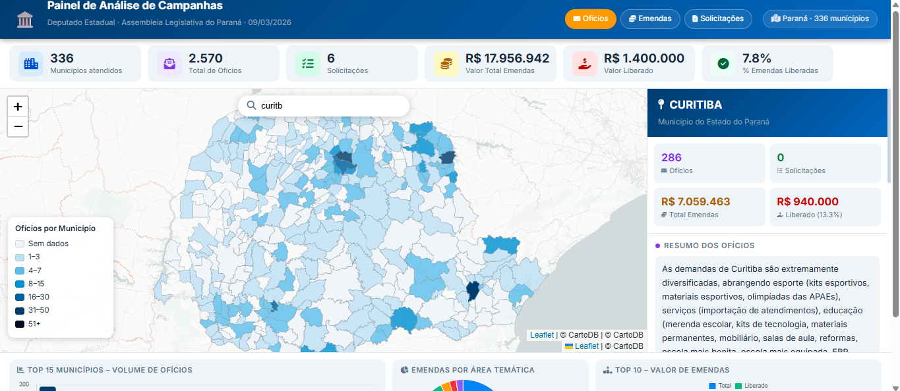
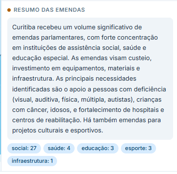
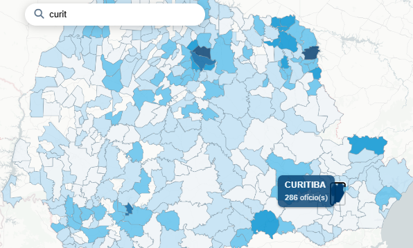
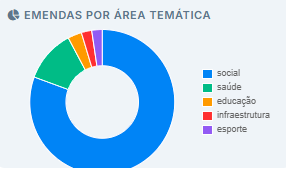
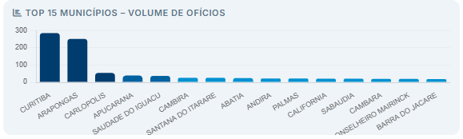

# Demonstracao - Automacao de Campanha (PR)

Projeto de consolidacao de dados de campanhas governamentais e geracao de dashboard geoespacial interativo e com resumos de ofícios por municipio do Parana.

## Resultado final

### Dashboard - Visao geral

### Dashboard - Detalhes e indicadores

	
	

	
	

